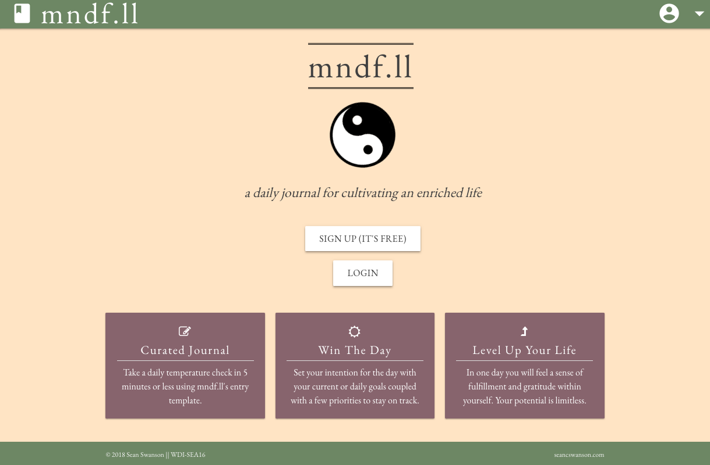
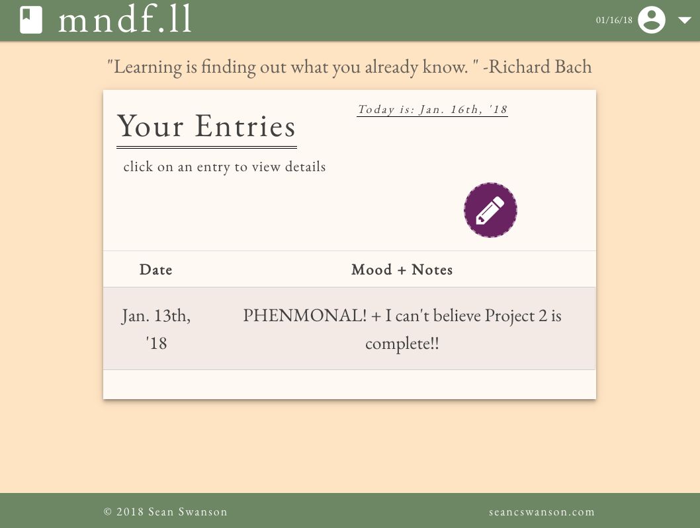

# mndf.ll
A daily journaling app that serves as a organizer for goal setting, mood tracking, and day-to-day musings! Sign up and start journaling with **mndf.ll** today!

## Instructions

1. Create an account.
2. Create a journal entry.
3. ???
4. Profit!!

## Getting Started

   To get started journaling with **mndf.ll** you may please:

   1. Visit the [Heroku site](https://mndfll-js.herokuapp.com)
   2. Fork and clone this repo, npm install dependencies, launch nodemon or other server.
   
## Prerequisites

  1. A willingness to accept positive changes in your life.
  2. Openness to personal enrichment through a daily practice
  3. Tenacity to achieve your goals.
  4. (Have NODE.js installed if cloning)

## Built With

  * HTML
  * CSS
  * JavaScript
  * Node
  * Express, Sequelize & numerous other Node modules
  * RESTful API architecture practices
  * [forismatic Quote API](http://forismatic.com/en/api/)

### User Stories

> As a user, I want to be able to create an account to use this service.
> As a user, I want to be able to create, view, update, and delete journal entries.

### Versioning

> As of **January 6, 2018** this app is in development whilst enrolled in General Assembly's WDI program and is initilized in this GitHub repo. NPM init files created, navbar partials created.

> As of **January 7, 2018** I made a big push with styling and got 70% of the design implemented using Materialize... lots of battling with class inheritance. Proud of my landing product page.

> As of **January 8, 2018** created views for viewing all journal entries, created partial for quote api, updated layouts of landing page for user experience.

> As of **January 9, 2018** added dynamic updating of user journal entries on the "view all" page updated views to reflect information from user. Created basic routes in my index.js and controllers. Created user and post model.

> As of **January 10, 2018** ran into a bug that required to add constraints on certain javascript functions to only run on particular URLs where it needs to be executed. Continuing work on update post, delete post functionality.

> As of **January 11, 2018** finished update functionality now working on user authentication, a big endeavor.

> As of **January 12, 2018** here lies the MVP. I finished random quote functionality, tidying up code/routes/added initial screenshot, finished auth functionality, styling touchups, finding and squashing bugs and... preparing for heroku launch!
 

## If I had more time I would...

> Add the ability to save a quote to a list of favorites to view later... maybe a share to social link.

> Convert wireframes to digital file.

> Post Trello flow.

## Authors

**Sean Swanson** - principal developer, bug squasher, goal setter.

### Acknowledgments

1. A hat tip to General Assembly Seattle's WDI-16 Instruction team for constant love and support during the program!
2. Inspiration coming from the '_5-Minute-Journal_' team, who programmed the first journaling app that was my foray into introspective reflection and the practice of gratitude.
3. _**"You"**_ for visiting this repo and being so lovely.
